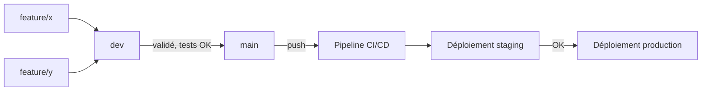

# Stratégie Git — HRFlow

La stratégie de gestion des branches détermine la manière dont les développements sont
organisés, intégrés et validés au sein du dépôt. Deux approches sont couramment utilisées :
**Git Flow** et **Trunk-Based Development**.

## Choix retenu : Git Flow adapté

Le projet **NovaTech HRFlow** s'appuie sur une stratégie **inspirée de Git Flow** :

- Les nouvelles fonctionnalités sont développées sur des branches dédiées (`feature/*`).
- Elles sont fusionnées dans la branche `dev` après validation.
- Une fois les développements testés, `dev` est intégrée dans `main`, qui représente la version
  stable et déployable du projet.

## Pourquoi ce choix plutôt que Trunk-Based Development

Le **Trunk-Based Development** privilégie une intégration très fréquente des modifications
directement sur une branche principale unique. Cette approche est particulièrement adaptée aux
projets disposant d'une chaîne d'intégration continue et de tests automatisés complets et rapides
(déploiements multiples par jour, feature flags pour masquer le code inachevé en prod).

Git Flow a été retenu à la place pour plusieurs raisons concrètes à l'échelle de ce projet :

- **Travail collaboratif à plusieurs personnes** sur des modules différents (auth, paie, congés,
  recrutement) sans se marcher dessus sur une branche unique.
- **Développement simultané de plusieurs fonctionnalités**, chacune isolée dans sa propre
  branche, sans bloquer les autres en cas de bug ou de retard.
- **Limitation du risque sur `main`** : une fonctionnalité cassée reste cantonnée à sa branche, ne
  peut pas atteindre la production tant qu'elle n'a pas été validée sur `dev`.
- **Historique Git plus lisible** : chaque feature/fix est identifiable, ce qui facilite la revue
  de code et le diagnostic en cas de régression (cf. `docs/incident-aout-2024.md`, où l'absence de
  ce type de traçabilité avait compliqué l'investigation).

Compte tenu de la taille de l'équipe et du niveau d'automatisation actuel de la CI (couverture de
tests encore partielle, cf. `docs/PLAN-DE-TESTS.md`), Git Flow reste le meilleur compromis entre
simplicité, traçabilité et stabilité des développements. Une bascule vers du Trunk-Based serait
envisageable une fois la couverture de tests et les feature flags plus matures.

## Schéma des branches

## Convention de nommage

| Type de branche | Format | Exemple |
|---|---|---|
| Fonctionnalité | `feature/<nom>` | `feature/recrutement-v2` |
| Correctif | `fix/<nom>` | `fix/cd-traefik` |
| Développement personnel/expérimentation | `dev-<initiales>` | `dev-lpa`, `dev-pwj` |
| Intégration | `dev` | — |
| Stable / déployable | `main` | — |

## Ce que déclenche chaque branche dans la CI

D'après `.github/workflows/pipeline.yml` :

- **Tout push**, quelle que soit la branche : `changes` → `codeql` + `security` → `build-tests`.
- **Push sur `dev-*` ou `main`** uniquement : en plus, `docker` (build + push ECR) puis
  `deploy-staging`.
- **Push sur `main`** uniquement, après succès de `deploy-staging` : `deploy-production`.

Ça garantit qu'aucune image n'est jamais poussée en registre ni déployée depuis une branche
`feature/*` isolée — seules `dev-*` et `main` touchent à une infra réelle.
